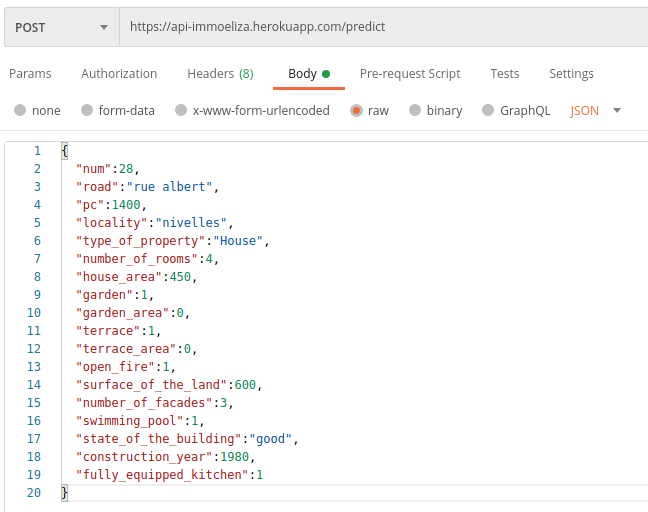

# API_ImmoEliza

This is the prediction price API part of a collaborative work between a web dev promotion and AI promotion. 

The purpose of this project is to create an application for the client ImmoEliza(fictive real estate agency), with a form to predict the price of a house or apartment.

### The prediction model

The prediction model was made using datas collected from Immoweb.be
You can find the repository for collecting the datas here : [Collecting_data](https://github.com/MDropsy/challenge-collecting-data)

The models can be find here : [ML_models](https://github.com/MDropsy/API_ImmoEliza/tree/main/ML_Model)

### The API 

https://api-immoeliza.herokuapp.com/predict

The models were deployed in an API using Heroku where you can make request on a prediction root

The request must be a POSTin a JSON format, here is a valid exemple : 

